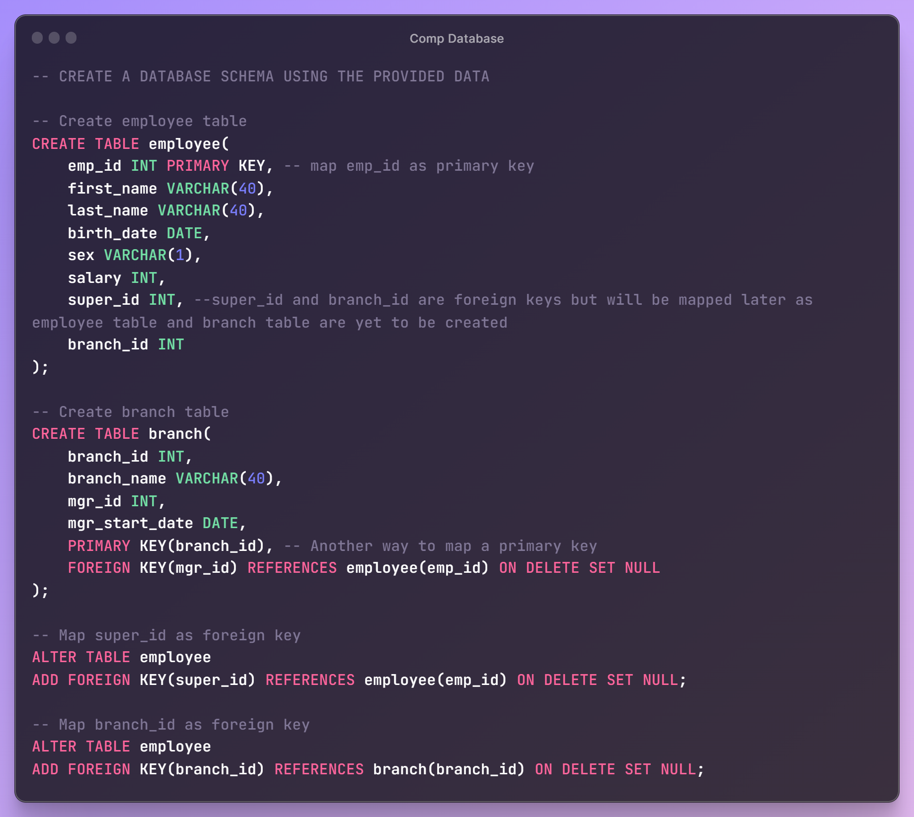
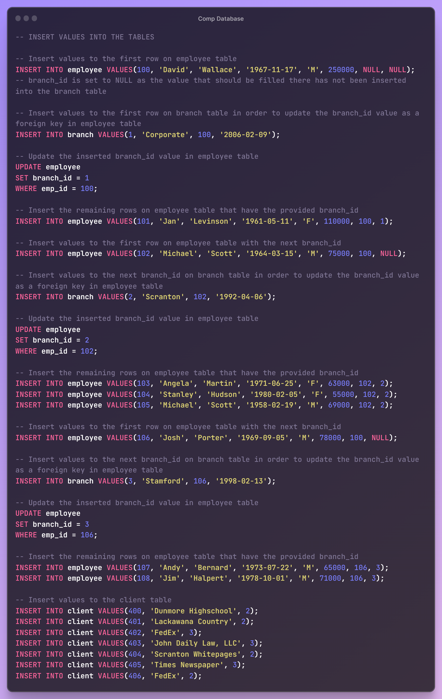

# DATABASE CREATION USING SQL

## Technologies

## Project Description
In this project, I built a full database from start to finish using MySQL Relational Database Management System. I created the database tables with their columns, mapped the primary and foreign keys for each table (there are columns that are both primary and foreign keys), then inserted row values to each table.

The work process was well documented using appropriate comments for easy understanding. You can take a look at the SQL file named 'Comp Database' on this repository to see the work done. This database is adequate for analysis using queries, and can serve as a model for creating other databases. You will find the work smooth and easy to code along.

## Preview

Here are some of the SQL codes used in this project.

## Author

This project was built by **Chidiebere David Ogbonna**.

Here are his details:

| Detail | Link |
| ------ | ---- |
| Profile | [LinkedIn](https://www.linkedin.com/in/chidieberedavidogbonna/) |
| Portfolio | [GitHub](https://github.com/iameberedavid) |
| Articles | [Medium](https://eberedavid.medium.com) |
| Tweets | [Twitter](https://twitter.com/iameberedavid) |
| Email | eberedavid326@gmail.com |

## License

This project is licensed under the MIT License - see the LICENSE file for details.

## Appreciation

Thanks for taking the time to go through this Readme.md file. Please feel free to browse through other repositories on this GitHub account for other projects on SQL, Excel, Power BI, Tableau, Python, R, and Machine Learning.